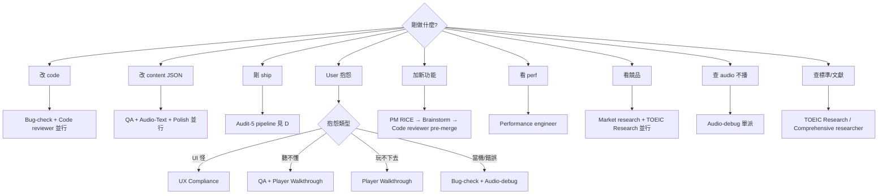

# Pickup Agent Dispatch Matrix

> Single-glance routing. 任何狀況 1 秒查表知道派誰 / 並行還順序 / 用哪個 model.
> v1 2026-06-01 (post B.160) — 4-agent → 5-agent audit framework.

## A. Decision Tree



## B. Agent Matrix (16 agent)

| Agent | subagent_type | 主任務 | 輸入 | 輸出 | 跑時 | 必派 | 別派 |
|---|---|---|---|---|---|---|---|
| QA | general-purpose | 對 `pickup-q-design-standard-v1.md` R1-R8/A1-A7 audit content | 改動 lessons JSON + spec | verdict + R# 違規清單 | 3-5m | content 改完、ship 前 | 純 code 改 |
| Bug-check | general-purpose | TS/race/schema/iOS 健檢 | diff scope + repo | bug list by severity | 3-5m | code 改完 | 純 JSON 改 |
| UX Compliance | general-purpose | 對 `pickup-ux-canonical-spec.md` R1-R14 | 改動 component + spec | R# pass/fail | 2-4m | UI 改 + ship 前 | API/data layer 改 |
| Audio-Text | general-purpose | speakerText vs DOM 對齊 | lesson JSON + component | mismatch table | 2-3m | 加聽力題、改 TTS 字串 | 視覺-only 改 |
| Player Walkthrough | all-agents:ui-ux-designer | 玩家視角 + 時間軸 + give-away 偵測 (NEW B.160) | deployed URL + 章節 | timeline table + 卡點 P0/P1/P2 | 5-8m | ship 後固定 | 後端-only 改 |
| TOEIC Research | all-agents:comprehensive-researcher | 找 listening item writing 文獻 | 問題 + 章節 scope | citation + 建議 | 8-15m | 新題型、爭議 spec | 已查過半年內 |
| Polish | general-purpose | A2 sentence 平滑化 | sentence list | 改寫對照表 | 5-10m | M1 polish、大批 import | 單句 hotfix |
| PM | general-purpose | RICE roadmap 排序 | feature 候選 + 數據 | RICE 排名 + 建議 | 5-8m | 季度規劃 | 單 bug 修 |
| Spec drift | general-purpose | 偵測 spec v2 R# 漂移 | 多 lessons + spec | 漂移點 | 3-5m | 多人改 spec | 單次小改 |
| Audio-debug | general-purpose | MP3/TTS 不播 root cause | console log + audio path | root cause + fix | 3-6m | 音訊壞 | UI bug |
| Comprehensive researcher | all-agents:comprehensive-researcher | 大盤點 (>3 主題) | 範圍描述 | 多主題 brief | 10-20m | quarterly review | 單窄問題 |
| Market research | all-agents:market-research-analyst | 競品 gap 分析 | 競品名單 + 維度 | gap matrix | 8-12m | roadmap 前、定價 | 內部 bug |
| UI/UX designer | all-agents:ui-ux-designer | 視覺 + 互動設計 | wireframe/需求 | mockup + rationale | 8-15m | 新 surface 設計 | 既有微調 |
| Code reviewer | all-agents:code-reviewer | 大改 second pair of eyes | PR diff | 風險 + 建議 | 3-5m | >200 行 diff、push main | <50 行 hotfix |
| Test automator | all-agents:test-automator | Playwright smoke 加 case | 新 surface URL | spec file | 5-10m | 新 critical flow | 仍 iterating |
| Performance engineer | all-agents:performance-engineer | LCP/bundle audit | deployed URL | bottleneck 排名 | 5-10m | 跨 perf budget | <50KB 改動 |

## C. Parallel vs Sequential + Model

**Parallel safe** (single message 多 Agent call):
- Audit-5: QA + Bug-check + UX + Audio-Text + Player Walkthrough
- Market + TOEIC Research
- PM + UI/UX designer

**Sequential 必須**:
1. TOEIC Research → spec 改 → QA (research 餵 spec)
2. Polish → QA (Polish 改的句子要重 audit)
3. Code reviewer → push (review 結果決定能否押)
4. Bug-check → Audio-debug (先排除一般 bug 再 deep dive audio)

**Model**:
- `haiku`: Spec drift / Test automator
- `sonnet`: 大部分 (QA / Bug-check / UX / Audio-Text / Player Walkthrough / Polish / PM / Code reviewer / Audio-debug)
- `opus`: TOEIC Research / Comprehensive / Market / UI/UX designer (judgement-heavy)

## D. Audit-5 Pipeline (deploy 後固定)

```
command: /pickup-audit-5 <deployed_url> <chapter_id> <lesson_id>

step 1 (parallel, 1 message 5 Agent calls):
  - Agent(QA, lessons JSON + spec v1)
  - Agent(Bug-check, last diff scope)
  - Agent(UX Compliance, surface + spec v2)
  - Agent(Audio-Text, lesson + component)
  - Agent(Player Walkthrough subagent_type=ui-ux-designer, url+chapter+lesson)

step 2 (等 5 個都回, ≤8 min):
  匯總 verdict — PASS / FAIL / WARN
  FAIL 任一 = block 下個 milestone
  WARN ≥ 2 = 開 follow-up issue
  全 PASS = chapter green、進下個

step 3: 寫 audit log → docs/audits/<date>-<chapter>.md
```

## E. Anti-pattern

1. **單句改錯字派 QA** — 直接 edit + Playwright smoke 即可,QA 跑 spec 全章太貴.
2. **每次改 code 都 Code reviewer** — <50 行 hotfix 自己讀 diff,留給 >200 行或 push main.
3. **Audio-debug 當第一招** — 先 Bug-check 排除 component/state,99% 是 race 不是 audio engine.
4. **TOEIC Research 重複問同題** — 半年內查過的標準直接引用 `docs/toeic-research/` 既有檔.
5. **Player Walkthrough 跑後端改動** — DB/API-only 改沒玩家視角差異,純浪費 token.

---

**Cross-refs**:
- 5-agent template `docs/agents/player-walkthrough.md`
- Spec `docs/toeic-research/pickup-ux-canonical-spec.md` R11
- Memory rule `feedback-pickup-post-iteration-audit`
- Master matrix `docs/product/pickup-master-matrix-2026-06.md`
